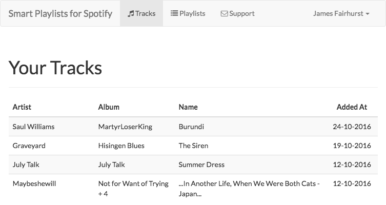

# Smart Playlists for Spotify

Tired of manually creating Playlists from your saved Tracks? This tool will help you create Smart Playlists based on Track & Album rules. Coming from iTunes and being able to easily create Smart Playlists I became frustrated with not being able to create them in Spotify so I made this.

## Features

Create Smart Playlists with Track/Album rules and these will be automatically created in Spotify from your list of saved Tracks.

## Todo

- More tests!
- Live updating in the background so Playlists are kept upto date
- Additional Playlist Rules
- Last.fm integration to get Track playcounts
- Display live Tracks when creating a new Playlist
- Edit a Playlist